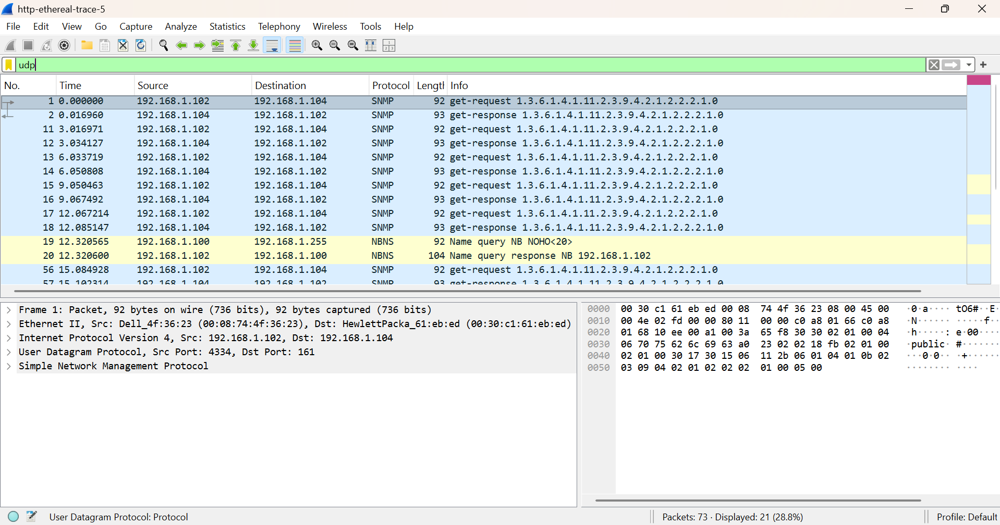

# Laporan5 Praktikum Jarkom IF

# modul 4 UDP

1. Buka browser, pergi ke link: http://gaia.cs.umass.edu/wireshark-labs/wireshark-traces.zip 
2. Download file ZIP tersebut
3. Ekstrak/extract file ZIP nya
    # Lampiran
    
4. Cari file bernama http-ethereal-trace-5 di dalam folder hasil ekstrak
5. Buka aplikasi Wireshark
6. Klik File → Open
7. Pilih file http-ethereal-trace-5 tadi
8. Di kolom filter atas, ketik udp lalu tekan Enter
9. Klik salah satu paket UDP yang muncul
10. Klik User Datagram Protocol untuk expand
    # Lampiran
    

Pertanyaan modul 5
1. Pilih satu paket UDP yang terdapat pada trace Anda. Dari paket tersebut, berapa banyak 
“field” yang terdapat pada header UDP? Sebutkan nama-nama field yang Anda temukan!
    # Lampiran
    
Header UDP punya 4 field, yaitu: Source Port, Destination Port, Length, Checksum

2. Perhatikan informasi “content field” pada paket yang Anda pilih di pertanyaan 1. Berapa 
panjang (dalam satuan byte) masing-masing “field” yang terdapat pada header UDP? 
    # Lampiran
    .png)
    .png)
    .png)
    .png)
Masing-masing field panjangnya 2 byte, jadi total header UDP = 8 byte.

3. Nilai yang tertera pada ”Length” menyatakan nilai apa? Verfikasi jawaban Anda melalui 
paket UDP pada trace. 
    # Lampiran
    
Field Length menyatakan total panjang paket UDP dalam byte, yaitu header (8 byte) + data/payload. Jadi kalau Length = 50, berarti payload-nya = 50 - 8 = 42 byte.

4. Berapa jumlah maksimum byte yang dapat disertakan dalam payload UDP?  
Field Length berukuran 2 byte = 16 bit, jadi nilai maksimumnya = 65535. Karena header UDP = 8 byte, maka maksimum payload = 65535 - 8 = 65527 byte.

5. Berapa nomor port terbesar yang dapat menjadi port sumber?
Field Source Port berukuran 2 byte = 16 bit, jadi nilai maksimumnya = 65535.

6. Berapa nomor protokol untuk UDP? Berikan jawaban Anda dalam notasi heksadesimal dan 
desimal. Untuk menjawab pertanyaan ini, Anda harus melihat ke bagian ”Protocol” pada 
datagram IP yang mengandung segmen UDP. 
    # Lampiran
    
Nomor protokol UDP adalah: Desimal: 17, Heksadesimal: 0x11

7. Periksa pasangan paket UDP di mana host Anda mengirimkan paket UDP pertama dan paket 
UDP kedua merupakan balasan dari paket UDP yang pertama. (Petunjuk: agar paket kedua 
merupakan balasan dari paket pertama, pengirim paket pertama harus menjadi tujuan dari 
paket kedua). Jelaskan hubungan antara nomor port pada kedua paket tersebut! 
    # Lampiran
    .png)
    .png)
Hubungannya adalah source port dan destination port saling bertukar.

