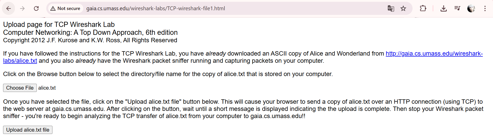

# Laporan6 Praktikum Jarkom IF

# modul 6 TCP

1. Buka browser, Masuk ke URL: http://gaia.cs.umass.edu/wireshark-labs/alice.txt
    # Lampiran
    
2. Buka URL: http://gaia.cs.umass.edu/wireshark-labs/TCP-wireshark-file1.html. Klik tombol Browse dan pilih file alice.txt yang tadi disimpan
    # Lampiran
    
sebelum klik upload, siapkan wireshark terlebih dahulu
3. Buka Wireshark, Pilih interface yang aktif
    # Lampiran
    
4. Kembali ke browser, klik tombol "Upload alice.txt file". Tunggu sampai muncul pesan "Success! You've uploaded..."
    # Lampiran
    